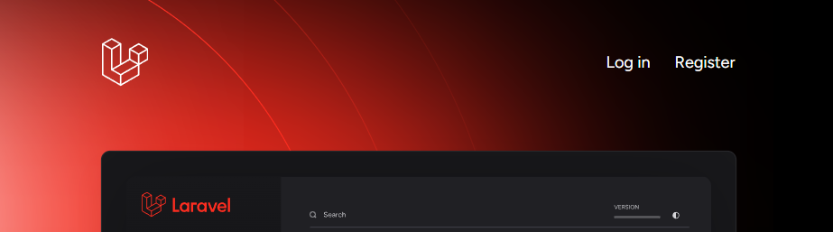
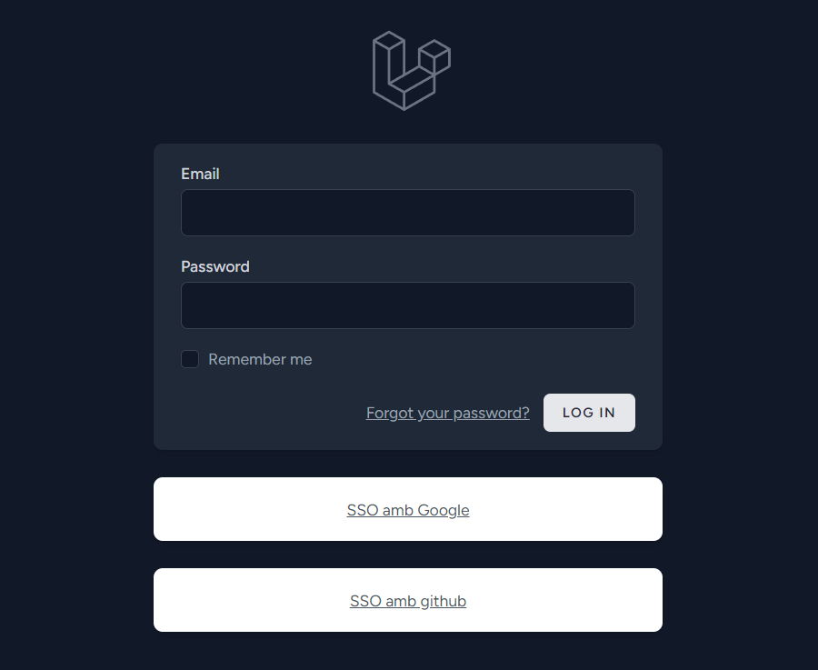

# DevChallenge 2: Sistema de inicio de sesión

<details>
  <summary><b>Otras versiones de idioma del README</b></summary>

- [Inglés](../README.md)

</details>

<details>
  <summary><b>Índice</b></summary>

- [DevChallenge 2: Sistema de inicio de sesión](#devchallenge-2-sistema-de-inicio-de-sesión)
  - [Sobre el proyecto](#sobre-el-proyecto)
  - [Prerequisitos](#prerequisitos)
  - [Primeros pasos](#primeros-pasos)
    - [1. Descarga el proyecto](#1-descarga-el-proyecto)
    - [2. Descarga e instala las dependencias](#2-descarga-e-instala-las-dependencias)
    - [3. Crea una copia del fichero ".env.example" que se llame ".env"](#3-crea-una-copia-del-fichero-envexample-que-se-llame-env)
    - [4. Crea el fichero SQLite](#4-crea-el-fichero-sqlite)
    - [5. Ejecuta las migraciones](#5-ejecuta-las-migraciones)
    - [6. Registra las credenciales de los proveedores OAuth](#6-registra-las-credenciales-de-los-proveedores-oauth)
    - [7. Prueba](#7-prueba)
  - [Errores conocidos](#errores-conocidos)
    - [1. Illuminate\\Encryption\\MissingAppKeyException: No application encryption key has been specified](#1-illuminateencryptionmissingappkeyexception-no-application-encryption-key-has-been-specified)

</details>

## Sobre el proyecto

Aplicación de inicio de sesión que permite a los usuarios acceder a un espacio indefinido donde pueden ver los datos asociados a la cuenta.

Este sistema permite:

- Iniciar sesión/registrarse en la aplicación usando el sistema de formulario tradicional.
- Iniciar sesión/registrarse en la aplicación usando un proveedor OAuth.
- Ver los datos asociados a la cuenta.

Por ahora, los proveedores OAuth que están soportados son:

- Google
- GitHub

Este proyecto se ha desarrollado usando [Laravel](https://github.com/laravel/laravel).

## Prerequisitos

- Instalar [Git](https://git-scm.com/downloads), el sistema de control de versiones.
- Instalar [PHP](https://www.php.net/downloads.php), asigna el comando a una variable de entorno para ejecutar PHP desde cualquier ruta en la que te encuentres dentro de la consola de comandos. Puedes seguir la [guía](https://www.geeksforgeeks.org/how-to-execute-php-code-using-command-line/) de GeeksForGeeks.
- Instalar [Node.JS](https://nodejs.org/es), si quieres saber más acerca puedes mirar la [documentación oficial](https://nodejs.org/docs/latest/api/).
- Instalar [NPM](https://www.npmjs.com/), para más información hecha un ojo a la [documentación oficial](https://docs.npmjs.com/).
- Instalar [Composer](https://getcomposer.org/), para más información hecha un ojo a la [documentación oficial](https://getcomposer.org/doc/).

## Primeros pasos

### 1. Descarga el proyecto

```bash
git clone https://github.com/Trane54/dev-challenge-2
cd dev-challenge-2
```

### 2. Descarga e instala las dependencias

```bash
composer update
composer install
```

### 3. Crea una copia del fichero ".env.example" que se llame ".env"

Pulsa la combinación de teclas Control+C sobre el fichero `.env.example`, Control+V y renombra el nuevo fichero a `.env`. 😃

### 4. Crea el fichero SQLite

Si quieres usar la configuración que hay por defecto para la base de datos, deberás crear un archivo con nombre `database.sqlite` dentro de la carpeta `/database`.

### 5. Ejecuta las migraciones

```bash
php artisan migrate:refresh
```

### 6. Registra las credenciales de los proveedores OAuth

En el fichero `.env` encontrarás las siguientes propiedades:

```text
GOOGLE_CLIENT_ID=YOUR-GOOGLE-CLIENT-ID
GOOGLE_SECRET=YOUR-GOOGLE-SECRET

GITHUB_CLIENT_ID=YOUR-GITHUB-CLIENT-ID
GITHUB_SECRET=YOUR-GITHUB-SECRET
```

Remplaza el texto de ejemplo por tus propias credenciales OAuth.

### 7. Prueba

Dentro de la carpeta del proyecto abre 2 consolas de comandos. En la primera tendremos el servidor NPM, el cual irá actualizando en tiempo real la web conforme vayamos haciendo cambios.

```bash
npm install
npm run dev
```

En la segunda consola de comandos, vamos a iniciar el servidor PHP.

```bash
php artisan serve
```

Una vez se haya iniciado el servidor de PHP, intenta acceder a [http://localhost:8000](http://localhost:8000), verás la página principal del proyecto.



Intenta registrar una cuenta o inicia sesión utilizando alguno de los proveedores OAuth disponibles.



## Errores conocidos

### 1. Illuminate\Encryption\MissingAppKeyException: No application encryption key has been specified

La primera vez cuando descargas un proyecto Laravel, necesitas generar una clave de encriptado.

Para generarla puedes usar el comando:

```bash
php artisan key:generate
```

Si recargas la página, el error no debería de aparecer.
